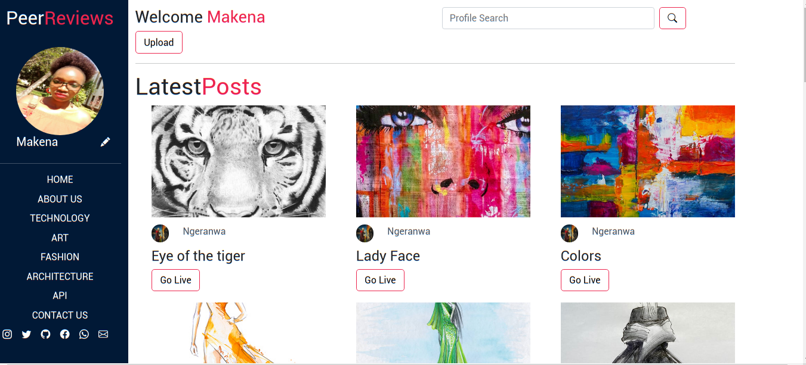

# peer-review
an application where users can review their peers' projects

## Live Link
https://peer-reviews.herokuapp.com/

# Landing page


# Profile page


# Signup page


### Requirements

* A computer,phone,tablet or an Ipad
* An access to the Internet

## Technology Used 
* HTML5
* CSS
* Bootstrap
* Python 3.9
* Heroku
* PostgreSql

## Setup
Run these commands on the terminal during setup:

* Make sure you have python installed. If not, use this command ```sudo apt install python3.9```
* Install Postgresql for ubuntu using ```sudo apt-get install postgresql```
* Clone the repository  by typing this command on terminal```git clone https://github.com/tori-bot/peer-review```
* Enter your local directory by typing this command on the terminal after cloning the repository ```cd peer-review```
* Install all requirements ```pip install -r requirements.txt```
* Test the application ```python3 manage.py test```
* Run the server on local machine ```python3 manage.py runserver```
* Follow the local host link ```127.0.0.1:8000``` to view application on your browser.
* For instrictions on deployment to Heroku follow this document [Heroku deployment](https://gist.github.com/newtonkiragu/42f2500e56d9c2375a087233587eddd0)

## Built with
* Django 4
* Bootstrap 5

## Known Bugs
* No known bugs. In case you discover any, please contact the author or open an issue on this repository.

## License

Copyright (c) 2022 MIT License. [View License Here](LICENSE)


## Author
Email Address: [makenavictoria1@gmail.com](mailto:makenavictoria1@gmail.com)